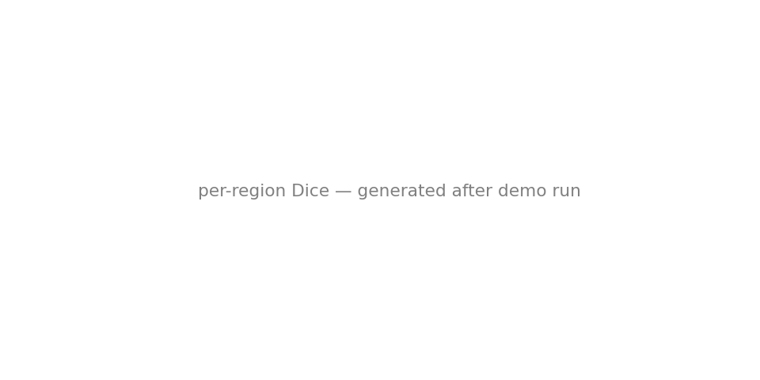
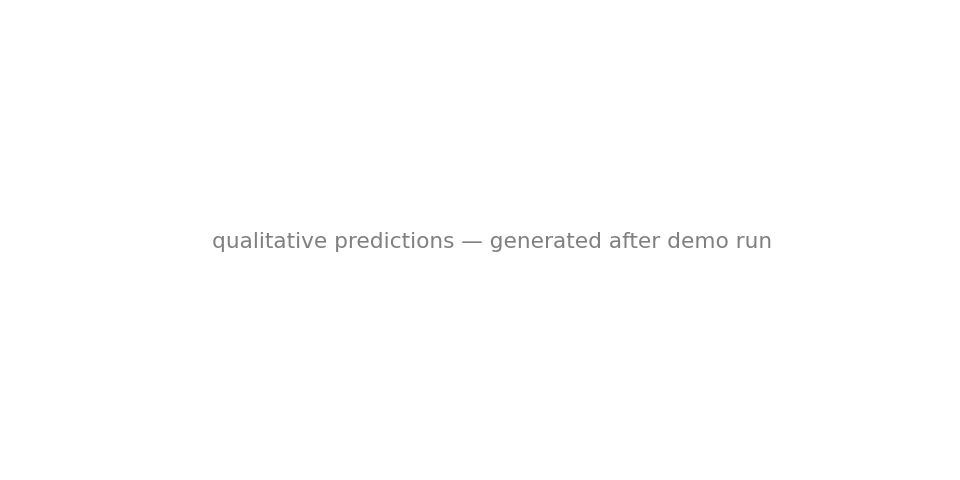
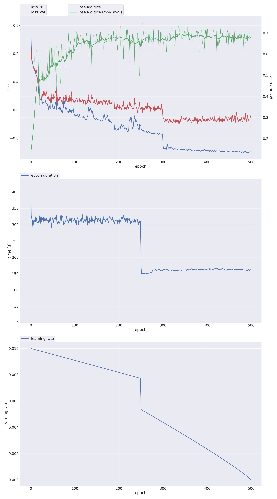
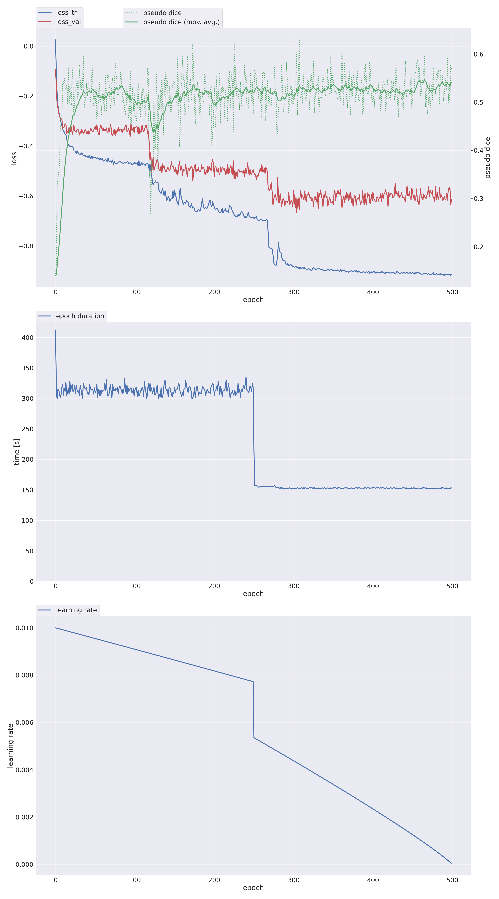

# BraTS-PED 2026 (Task 2) — Pediatric Brain Tumor Segmentation

A fully reproducible, containerized deep-learning pipeline for **Task 2 of the
MICCAI BraTS-PED 2026 challenge**: voxel-wise segmentation of four pediatric
brain-tumor sub-regions from four co-registered MRI sequences.

The method follows the repeatedly-validated recipe of recent BraTS winners
(BraTS-METS 2025 GLI team; BraTS-PED 2025 rank-1 Yi *et al.* and rank-2
Chen & Liang):

> **skull-strip → residual-encoder nnU-Net v2 (3D full-res, 5-fold ensemble) → lesion-wise post-processing**

<p align="center"><b>
raw MRI → HD-BET/SynthStrip brain extraction → nnU-Net v2 ResEnc-L (5-fold softmax ensemble + TTA) → lesion-wise component cleanup → label map
</b></p>

---

## Table of contents

1. [Challenge & labels](#1-challenge--labels)
2. [Method](#2-method)
3. [Repository layout](#3-repository-layout)
4. [Installation](#4-installation)
5. [Data setup](#5-data-setup)
6. [Quick start (end-to-end)](#6-quick-start-end-to-end)
7. [Training](#7-training)
8. [Inference](#8-inference)
9. [Post-processing](#9-post-processing)
10. [Evaluation](#10-evaluation)
11. [Docker / Apptainer container](#11-docker--apptainer-container)
12. [Results](#12-results)
13. [Reproducing the results](#13-reproducing-the-results)
14. [Technical report](#14-technical-report)
15. [References](#15-references)
16. [License, citation & acknowledgements](#16-license-citation--acknowledgements)

---

## 1. Challenge & labels

BraTS-PED targets pediatric high-grade gliomas (notably diffuse midline gliomas),
whose appearance differs substantially from adult tumors. Each subject provides
four co-registered, 1 mm³-isotropic MRI sequences:

| Channel | Sequence | nnU-Net index |
|--------:|----------|:-------------:|
| T1n | T1 native / pre-contrast | `0000` |
| T1c | T1 post-contrast | `0001` |
| T2w | T2-weighted | `0002` |
| T2f | T2-FLAIR | `0003` |

**Native labels** and their prevalence in the training cohort:

| Label | Region | Present in (of 294 train) |
|------:|--------|:--------------------------:|
| 1 | Enhancing tumor (ET) | 67 % |
| 2 | Non-enhancing tumor (NET) | 99 % |
| 3 | Cystic component (CC) | 35 % |
| 4 | Peritumoral edema (ED) | 22 % |

**Scored regions** combine the native labels:

| Region | Definition |
|--------|------------|
| ET | label 1 |
| NET | label 2 |
| CC | label 3 |
| ED | label 4 |
| **TC** (tumor core) | labels 1 + 2 + 3 |
| **WT** (whole tumor) | labels 1 + 2 + 3 + 4 |

**Metrics:** lesion-wise Dice (DSC) and lesion-wise Hausdorff-95 / Normalized
Surface Distance (NSD). The lesion-wise formulation evaluates each connected
component independently and penalizes small false-positive components heavily —
this directly motivates the post-processing stage below.

---

## 2. Method

| Stage | What | Why |
|-------|------|-----|
| **1. Skull-stripping** | HD-BET (GPU, batched) or SynthStrip removes skull/neck on every case, applied identically at train and test time. | BraTS-PED volumes are **not** skull-stripped; the skull confounds the network (confirmed by both 2025 top teams). |
| **2. nnU-Net v2, ResEnc-L, 3D full-res** | Self-configuring residual-encoder U-Net. Dice + cross-entropy loss, SGD (Nesterov 0.99), lr 1e-2 poly decay, deep supervision, heavy augmentation. | State-of-the-art, hands-off backbone that auto-adapts patch size, spacing and architecture to the dataset fingerprint. |
| **3. Five-fold ensemble + TTA** | Softmax averaging across 5 cross-validation folds, with mirror test-time augmentation. | The single largest accuracy lever on a small (≈294-case) dataset. |
| **4. Lesion-wise post-processing** | Relabel tiny ET/CC components → NET, remove tiny ED components (thresholds in `code/config.py`). | Directly optimizes the lesion-wise metric by suppressing penalized small false positives. |

All paths are environment-overridable, so the identical code runs on a
workstation, a SLURM node, and inside the container.

---

## 3. Repository layout

```
BraTS2026_PED/
├── code/                       # pip-installable package (brats_ped)
│   ├── config.py               # all paths, labels, planner & post-proc rules
│   ├── skull_strip.py          # HD-BET / SynthStrip brain extraction (batched)
│   ├── prepare_dataset.py      # BraTS → nnU-Net v2 format (+ 10-case holdout)
│   ├── train.py                # plan / preprocess / train (resumable)
│   ├── inference.py            # nnU-Net prediction (ensemble + TTA)
│   ├── postprocess.py          # lesion-wise component relabel / removal
│   ├── evaluate.py             # voxel-wise DSC / NSD vs ground truth
│   ├── evaluate_lesionwise.py  # lesion-wise DSC / HD95 (challenge metric)
│   ├── plot_training.py        # training/val loss & Dice curves → PNG
│   ├── predict_entry.py        # full-chain container entrypoint
│   ├── set_batch_size.py       # HD-BET batch helper
│   ├── setup.py / requirements.txt
│   ├── setup_env.sh / run_pipeline.sh
│   └── slurm/                  # prep / train / infer sbatch + submit wrappers
├── docker/                     # Dockerfile + apptainer.def + build/run scripts
├── report/                     # LaTeX technical report (+ figure generator)
├── results/                    # CV & held-out metric CSVs (this repo)
├── assets/                     # plots embedded in this README
└── README.md
```

> **Not tracked** (large / non-redistributable, see `.gitignore`): challenge
> `data/`, skull-stripped `data_ss/`, the `nnUNet/` workspace + weights, `venv/`,
> raw `predictions/`, and SLURM logs.

---

## 4. Installation

Targets a single **NVIDIA RTX Pro 6000 (96 GB, Blackwell)**; also runs on any
CUDA-12.x GPU. Python 3.10/3.11.

```bash
# from the project root — creates ./venv, installs CUDA torch + all deps
bash code/setup_env.sh                 # CUDA 12.8 (default)
bash code/setup_env.sh --cuda 12.4     # other CUDA 12.x GPUs
bash code/setup_env.sh --cpu           # CPU-only (smoke-testing; training needs GPU)
```

Or manually:

```bash
python3.11 -m venv venv && source venv/bin/activate
pip install torch torchvision --index-url https://download.pytorch.org/whl/cu128
pip install -e code                     # installs nnU-Net v2, HD-BET, NiBabel, SimpleITK, SciPy, …
```

`pip install -e code` installs the `brats_ped` package and console scripts
(`bratsped-strip`, `bratsped-train`, `bratsped-infer`, …). nnU-Net workspace
directories (`nnUNet/nnUNet_{raw,preprocessed,results}`) are created automatically.

---

## 5. Data setup

Point `code/config.py` — or the `BRATS_PED_TRAIN` / `BRATS_PED_VAL` environment
variables — at the challenge data:

```
data/BraTS26_PED_training_Complete/BraTS-PED-XXXXX-000/
    BraTS-PED-XXXXX-000-{t1n,t1c,t2w,t2f}.nii.gz   +   -seg.nii.gz   (training has GT)
data/BraTS26_PED_validation/BraTS-PED-XXXXX-000/
    BraTS-PED-XXXXX-000-{t1n,t1c,t2w,t2f}.nii.gz                     (validation: no GT)
```

The challenge data is **not redistributed** here — request access through the
[Synapse BraTS portal](https://www.synapse.org/brats).

---

## 6. Quick start (end-to-end)

Local driver (no SLURM) — runs the whole chain on one GPU:

```bash
bash code/run_pipeline.sh all          # strip → prepare → preprocess → train → infer → postproc → evaluate
```

Individual steps (each can be run on its own):

```bash
bash code/run_pipeline.sh strip        # skull-strip train + val
bash code/run_pipeline.sh prepare      # → nnU-Net format, hold out 10 cases
bash code/run_pipeline.sh preprocess   # nnU-Net plan & preprocess
bash code/run_pipeline.sh train --folds 0 1 2 3 4
bash code/run_pipeline.sh infer  --folds 0 1 2 3 4 --tta
bash code/run_pipeline.sh postproc
bash code/run_pipeline.sh evaluate
```

---

## 7. Training

### On SLURM (recommended, resumable)

```bash
bash code/slurm/submit_train.sh 0              # prep (strip + preprocess) → train fold 0
bash code/slurm/submit_train.sh 0 1 2 3 4      # full 5-fold ensemble
```

The wrapper inspects `sinfo`, picks an available **RTX Pro 6000** node, requests
`--gpus=1`, and chains `prep → train` with `afterok` dependencies.

**Checkpointing / resume.** nnU-Net saves `checkpoint_best.pth` (best EMA Dice)
and `checkpoint_latest.pth` (every 50 epochs). Jobs are `--requeue`-enabled and
auto-resume with `--c` after a timeout — a GPU timeout never loses more than ~50
epochs. Training curves are exported automatically by `plot_training.py`.

### Configuration knobs (env vars, see `code/config.py`)

| Variable | Default | Meaning |
|----------|---------|---------|
| `BRATS_PED_PLANNER_CLASS` | `nnUNetPlannerResEncL` | ResEnc preset (M / **L** / XL) |
| `BRATS_PED_PLANNER` | `nnUNetResEncUNetLPlans` | matching plans identifier |
| `BRATS_PED_CONFIG` | `3d_fullres` | nnU-Net configuration |
| `BRATS_PED_TRAINER` | `nnUNetTrainer` | trainer (epoch-count variants supported) |
| `BRATS_PED_FOLD` | `0` | fold, or `all` for a single full-data model |

> **Compute budget.** Trained under a fixed GPU-day budget; the shipped ensemble
> used a reduced-epoch trainer (`nnUNetTrainer_500epochs`) per fold to fit five
> folds in budget while keeping the ensembling gain.

---

## 8. Inference

```bash
source venv/bin/activate
python code/inference.py \
    --input  data_ss/validation \
    --output predictions/raw \
    --raw-input --folds 0 1 2 3 4 --tta
```

`--raw-input` accepts skull-stripped per-subject folders; the script maps the
four modalities to nnU-Net channel indices, runs the ensemble, and writes one
label map per subject.

---

## 9. Post-processing

```bash
python code/postprocess.py --input predictions/raw --output predictions/postprocessed
```

Lesion-wise component rules (`POSTPROC_RULES` in `code/config.py`):

| Region | Rule | Action |
|--------|------|--------|
| ET | component < 50 vox | reassign → NET |
| CC | component < 150 vox | reassign → NET |
| ED | component < 100 vox | remove (→ background) |
| NET | — | kept as-is |

---

## 10. Evaluation

```bash
# voxel-wise DSC / NSD
python code/evaluate.py            --pred predictions/postprocessed --gt <labelsTr> --output results/voxelwise.csv
# lesion-wise DSC / HD95 (official challenge metric)
python code/evaluate_lesionwise.py --pred predictions/postprocessed --gt <labelsTr> --output results/lesionwise.csv
```

Both write per-case rows plus aggregate `MEAN` / `STD`.

---

## 11. Docker / Apptainer container

The container implements the BraTS-Lighthouse algorithm contract: it reads
`/input` (one folder per subject with the four modalities) and writes
`/output/<SubjectID>.nii.gz`. Skull-stripping, ensemble prediction and
post-processing all run **inside** the container.

### Build

```bash
bash docker/build.sh                         # stage trained model (fold 0) + build
FOLDS="0 1 2 3 4" bash docker/build.sh       # bake the full 5-fold ensemble
CHECKPOINT=checkpoint_best.pth bash docker/build.sh
```

`build.sh` auto-detects Docker or Apptainer, copies only the inference-time
essentials (`plans.json`, `dataset.json`, fingerprint, fold checkpoints) into
`docker/model/`, and builds `bratsped2026:latest` (or `docker/bratsped2026.sif`).

### Run

```bash
# Docker
docker run --gpus all --rm \
    -v /path/cases:/input:ro -v /path/out:/output \
    bratsped2026:latest

# Apptainer (HPC)
apptainer run --nv \
    --bind /path/cases:/input --bind /path/out:/output \
    docker/bratsped2026.sif
```

### Sanity-check on held-out cases

```bash
bash docker/run_sample.sh        # runs on the 10 held-out cases (with GT) and scores them
```

---

## 12. Results

All numbers below are **lesion-wise Dice (LWdice)** and **lesion-wise HD95**
unless noted, computed with `code/evaluate_lesionwise.py`. CSVs live in
[`results/`](results/).

### 12.1 Five-fold cross-validation (out-of-fold, n ≈ 285 training cases)

The most honest estimate of generalization — every case scored by a model that
never saw it.

| Region | LWdice (mean ± std) | LW HD95 (mm) |
|--------|:-------------------:|:------------:|
| ET  | 0.652 ± 0.375 | 87.0 |
| NET | 0.707 ± 0.298 | 54.1 |
| CC  | 0.657 ± 0.451 | 111.1 |
| ED  | 0.792 ± 0.387 | 64.7 |
| **TC** | **0.797 ± 0.239** | 33.2 |
| **WT** | **0.834 ± 0.208** | 23.6 |

→ [`results/cv5fold_oof_lesionwise.csv`](results/cv5fold_oof_lesionwise.csv)

### 12.2 Held-out internal test set (10 subjects, never trained on)

**Voxel-wise** DSC / NSD (`evaluate.py`):

| Region | DSC | NSD |
|--------|:---:|:---:|
| ET  | 0.448 | 0.517 |
| NET | 0.839 | 0.736 |
| CC  | 0.132 | 0.161 |
| **TC** | 0.876 | 0.734 |
| **WT** | **0.914** | 0.769 |

**Lesion-wise** DSC, raw vs. post-processed (`evaluate_lesionwise.py`):

| Region | Raw LWdice | Post-proc LWdice | Δ |
|--------|:----------:|:----------------:|:--:|
| ET  | 0.419 | 0.431 | +0.012 |
| NET | 0.804 | 0.804 | — |
| CC  | 0.654 | 0.653 | −0.001 |
| ED  | 0.700 | 0.700 | — |
| TC  | 0.832 | 0.832 | — |
| WT  | 0.870 | 0.870 | — |

Post-processing gives a small ET improvement (LWdice +0.012, HD95 110→99 mm) and
is neutral elsewhere — consistent with the lesion-wise metric rewarding removal of
small ET false positives.

→ [`results/holdout10_postproc_lesionwise.csv`](results/holdout10_postproc_lesionwise.csv),
[`results/holdout10_raw_lesionwise.csv`](results/holdout10_raw_lesionwise.csv),
[`results/holdout10_postproc_voxelwise.csv`](results/holdout10_postproc_voxelwise.csv)

### 12.3 Plots

Per-region scores:



Qualitative overlay (held-out case):



Training / validation curves (representative folds):




> **Takeaways.** TC and WT are strong (0.80 / 0.83 OOF). ET and CC are the weak,
> high-variance regions — driven by the many cases where these labels are absent
> or tiny, which the lesion-wise metric penalizes hardest. They are the main
> targets for further work (e.g. ET-specific thresholds, class-balanced sampling).

---

## 13. Reproducing the results

```bash
bash code/setup_env.sh                          # 1. environment
# 2. place challenge data under data/ (see §5)
bash code/slurm/submit_train.sh 0 1 2 3 4       # 3. strip + preprocess + train 5 folds
python code/inference.py --input data_ss/validation --output predictions/raw --raw-input --folds 0 1 2 3 4 --tta
python code/postprocess.py --input predictions/raw --output predictions/postprocessed
python code/evaluate_lesionwise.py --pred predictions/postprocessed --gt nnUNet/nnUNet_raw/Dataset021_BraTSPED2026/labelsTr --output results/lesionwise.csv
```

The held-out 10-case split is deterministic (`HOLDOUT_SEED = 1337`,
`prepare_dataset.py` → `holdout_test_cases.txt`).

---

## 14. Technical report

A LaTeX technical report is in [`report/main.tex`](report/main.tex) (pre-built
`report/main.pdf`). Regenerate figures with `python report/make_figures.py`, then
`pdflatex main.tex`.

---

## 15. References

1. **nnU-Net** — Isensee F. *et al.* "nnU-Net: a self-configuring method for deep
   learning-based biomedical image segmentation." *Nature Methods* 18, 203–211 (2021).
2. **Residual-encoder nnU-Net presets** — Isensee F. *et al.* "nnU-Net Revisited:
   A Call for Rigorous Validation in 3D Medical Image Segmentation." *MICCAI* 2024 /
   arXiv:2404.09556.
3. **BraTS-PED challenge** — Kazerooni A.F. *et al.* "The Brain Tumor Segmentation
   (BraTS) Challenge 2023: Focus on Pediatrics." arXiv:2305.17033 / 2404.15009.
4. **BraTS overview** — Menze B.H. *et al.* "The Multimodal Brain Tumor Image
   Segmentation Benchmark (BRATS)." *IEEE TMI* 34(10), 1993–2024 (2015);
   Baid U. *et al.* arXiv:2107.02314.
5. **SynthStrip** — Hoopes A. *et al.* "SynthStrip: skull-stripping for any brain
   image." *NeuroImage* 260, 119474 (2022).
6. **HD-BET** — Isensee F. *et al.* "Automated brain extraction of multisequence
   MRI using artificial neural networks." *Human Brain Mapping* 40(17), 4952–4964 (2019).
7. **BraTS-PED 2025 top solutions** — Yi *et al.* (rank-1) and Chen & Liang
   (rank-2), BraTS 2025 proceedings (method recipe adopted here).
8. **Lesion-wise evaluation** — BraTS lesion-wise metric, as used by the
   BraTS-Lighthouse evaluation pipeline.

---

## 16. License, citation & acknowledgements

- **Code license:** see [`code/LICENSE`](code/LICENSE).
- **Data:** subject to the BraTS / Synapse data-use agreement — not redistributed here.

If you use this pipeline, please cite the nnU-Net and BraTS-PED references above
and link to this repository.

**Acknowledgements.** Built on nnU-Net v2 (MIC-DKFZ), HD-BET / SynthStrip, and
the methodological lead of the BraTS-PED 2025 top-ranked teams. Compute provided
by the Emory HyPER C3 cluster.
